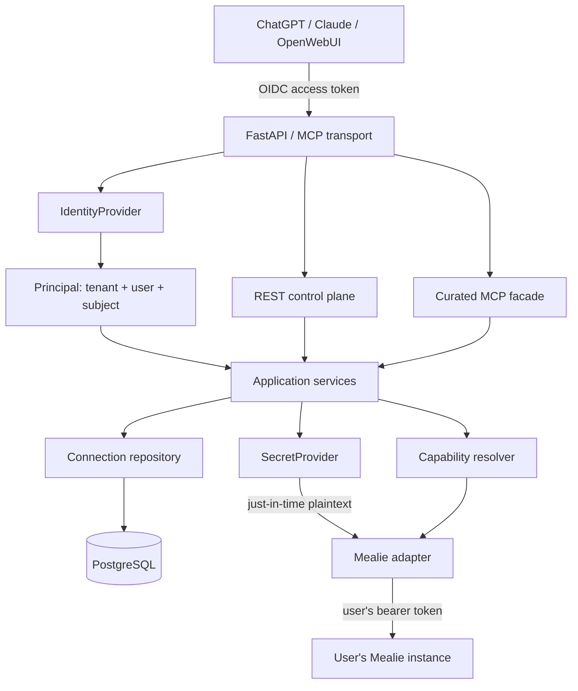
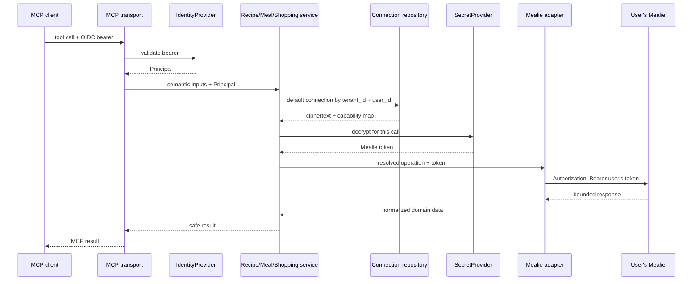

# Mealie MCP service architecture proposal

Research snapshot: 2026-09-17. The target Mealie release is 3.26.x and the
target official Python MCP SDK is the stable 2.2.x line.

## Decision summary

This service is an OAuth-protected application with two interfaces: a normal
REST control plane and a curated MCP data plane. Authentik proves the caller's
application identity. PostgreSQL maps that identity to one or more Mealie
connections. A secret provider decrypts only the selected connection's Mealie
token, and a schema-aware adapter uses that token against that connection's
origin. MCP tools call application services; they never read credentials or
construct Mealie URLs.

The first release is read-only. It exposes `search_recipes`, `get_recipe`,
`get_meal_plan`, `get_shopping_lists`, and `get_shopping_list`. These names and
their semantic inputs are our stable contract. Live Mealie OpenAPI documents
select allowlisted operations below that contract. Unknown OpenAPI operations
are never exposed.

PostgreSQL is required in deployed environments. Tests may use SQLite through
the same SQLAlchemy repositories so security properties can be exercised
without external infrastructure.

## System boundary



MCP authentication and Mealie authentication are deliberately unrelated.
The former identifies a service principal. The latter is an encrypted,
separately supplied credential scoped by Mealie to its issuing user, group,
and household. A Mealie token is never placed in an OIDC claim, MCP argument,
MCP result, log field, trace attribute, exception, URL, or browser cookie.

## Component responsibilities

### Configuration and composition

`app/config.py` owns validated environment configuration. `app/main.py` is the
composition root: it creates database, identity, secret, HTTP, repository, and
service objects; mounts the official SDK's Streamable HTTP ASGI app; and owns
the MCP session manager in the parent FastAPI lifespan. No module-level
mutable downstream credential or current-user state is permitted.

### Identity

`IdentityProvider` accepts a bearer token and returns a provider-neutral
`Principal(subject, user_id, tenant_id, email, scopes)`. The Authentik
implementation uses OIDC discovery and JWKS, pins configured asymmetric
algorithms, and verifies signature, exact issuer, audience, expiry, and
required scopes. An unknown `kid` causes one rate-limited JWKS refresh to
support key rotation. Discovery metadata and JWKS are bounded, cached, and
fetched without caller credentials.

The initial identity resolver derives a stable opaque user UUID from the
configured identity namespace plus the validated subject. This allows separate
OIDC applications to reconcile the same Authentik user when they use the same
stable subject mode; the validating issuer remains on `Principal` for audit.
The tenant UUID continues to use the namespace plus configured default tenant
identifier. This avoids using mutable email as identity. A future SaaS provider
can replace resolution with provisioned tenant and membership rows without
changing service APIs.

The official MCP SDK's `AccessToken` carries the validated subject and safe
claims into tool request context. FastAPI dependencies invoke the same
provider for REST. Python context variables are used only for logging fields,
never as the authoritative credential selector; every repository call receives
an explicit `Principal`.

### Persistence

SQLAlchemy 2 async sessions are request scoped. Alembic owns schema changes.
The core table is intentionally one-to-many from service user to connection:

```text
mealie_connections
  id                  UUID primary key
  tenant_id           UUID, indexed
  user_id             UUID, indexed
  name                bounded text
  base_url             canonical origin (scheme + host + optional port)
  encrypted_api_token  text/blob (provider-owned envelope)
  is_default           boolean
  mealie_user_id       nullable text
  mealie_version       nullable text
  openapi_schema_hash  nullable sha256 hex
  capabilities         JSON object containing safe normalized metadata
  schema_source        live | cached
  status               pending | active | degraded | invalid | disabled
  last_validated_at    nullable timestamptz
  created_at           timestamptz
  updated_at           timestamptz
```

A unique partial index enforces at most one default connection for each
`(tenant_id, user_id)`. Every lookup and mutation includes both tenant and user
predicates, even when IDs are globally unique. This is defense in depth and
makes isolation visible in code review. Deletion removes the encrypted value
and metadata; credential replacement is write-only.

### Secrets

`SecretProvider` exposes `encrypt(SecretStr) -> ciphertext` and a narrow
decryption context. `LocalEncryptedSecretProvider` uses Fernet authenticated
encryption with a dedicated environment key. Models store opaque ciphertext
and know nothing about cryptography. Plaintext is materialized immediately
before building the Authorization header, scoped to one downstream call, and
references are discarded afterward. Python cannot guarantee physical memory
zeroization; future KMS envelope encryption can reduce key exposure while
preserving the interface.

The local key is not derived from a password and has no default. Production
startup fails when it is absent. Key rotation is a later provider concern and
should use versioned envelopes rather than modifying ORM behavior.

### Destination policy and downstream HTTP

Connection URLs are canonical origins: `http` or `https`, no userinfo, query,
fragment, or non-root path. SaaS mode requires HTTPS and rejects loopback,
unspecified, multicast, link-local, carrier-grade NAT, RFC1918/ULA, reserved,
and cloud metadata destinations. It resolves every hostname and rejects the
whole result when any answer is forbidden.

Self-hosted mode still rejects malformed and special-use destinations but may
permit private addresses only when `MEALIE_PRIVATE_NETWORKS` explicitly lists
matching CIDRs or `MEALIE_ALLOWED_HOSTS` explicitly lists hostnames. Cloud
metadata hostnames, IPv4 link-local, IPv6 link-local, and documented AWS,
Google Cloud, Azure, and Alibaba metadata/platform addresses are categorical
denials that neither setting can override. SaaS mode rejects all destination
exceptions during configuration validation and still enforces public-address
checks at request time.

Validation runs when a connection is submitted and immediately before each
downstream request. Redirects are disabled. Timeouts, pool limits, JSON body
limits, and streamed response limits are enforced. Only GET/HEAD requests may
receive bounded retries for connection failures, 429, and selected 5xx
responses. Mutations are never retried by default.

Application-layer DNS checks have a time-of-check/time-of-use gap because the
standard HTTP transport resolves again. For an internet-facing SaaS rollout,
the required completion is an egress proxy or network firewall that denies
special-use ranges after DNS resolution (or a custom transport that connects
to a validated pinned address while preserving TLS SNI). The application
checks remain useful defense in depth but are not claimed as the only SaaS
control.

### Mealie OpenAPI adaptation

Validation performs this sequence:

1. Canonicalize and authorize the destination.
2. Call `GET /api/users/self` with the submitted Mealie token to establish
   credential validity and capture the Mealie user ID.
3. Call `GET /api/app/about` where supported to obtain the version.
4. Fetch same-origin `GET /openapi.json` with redirects disabled and a bounded
   response.
5. Parse JSON, reject external `$ref` values, and resolve local JSON pointers
   with cycle and depth limits.
6. Normalize the schema deterministically and calculate SHA-256.
7. Scan all operations and score only curated capability candidates using HTTP
   method, exact known paths, known operation IDs, allowlisted tags, path
   semantics, typed semantic parameters, request bodies, and successful JSON
   response shape. Refuse weak, tied, or incompatible candidates.
8. Persist the compact capability map and hash in the same transaction as the
   validation result.

Initial mappings are:

| Capability | Preferred current operation | Stable service operation |
| --- | --- | --- |
| `recipe.search` | `GET /api/recipes` | search with pagination and filters |
| `recipe.get` | `GET /api/recipes/{slug}` | get by slug |
| `mealplan.read` | `GET /api/households/mealplans` | date-range plan |
| `shopping.list` | `GET /api/households/shopping/lists` | list summaries |
| `shopping.get` | `GET /api/households/shopping/lists/{item_id}` | list details |
| `identity.self` | `GET /api/users/self` | validation only |

Operation IDs are hints rather than the sole compatibility key because Mealie's
FastAPI-generated IDs can change when Python function names change. Exact known
paths carry strong weight. A moved route must retain matching path semantics and
either a known operation ID or an allowlisted tag, then pass parameter and
response checks and the minimum confidence threshold. A close second candidate
makes the capability unavailable.
Unknown new endpoints cannot enter the curated facade merely by appearing in
OpenAPI.

Request construction uses the resolved operation descriptor, percent-encodes
path values, and accepts only declared semantic inputs. Stable names such as
`page_size`, `slug`, and `shopping_list_id` map explicitly to supported schema
aliases such as `perPage`, `pageSize`, `recipeSlug`, or `item_id`. The model
cannot pass a path, method, arbitrary headers, or arbitrary OpenAPI operation.

The previous hash and compact capability map are retained. On change, the
validator records added/lost/changed curated capabilities and marks a
connection degraded if a required read capability disappears. One missing
operation does not stop unrelated tools or the service.

The cached schema for a connection may be used to explain its last-known
capabilities during a transient validation failure, but it does not turn a
failed validation into success. A bundled upstream snapshot is useful in tests
and compatibility CI. It should not be used at runtime to claim an operation
exists on an unknown server; this corrects a risky property of broad dynamic
generators.

### Application services and curated MCP facade

Services accept a `Principal`, resolve that principal's selected connection,
require a capability, decrypt its credential, invoke the adapter, and return a
bounded normalized result. MCP and REST handlers are thin presenters over
these services.

All five first-release tools are registered because SDK tool catalogs are
normally server-wide, while capabilities differ per user and connection.
Invocation returns a clear, typed unavailable error when the caller's selected
connection lacks a capability. Per-principal dynamic tool registration would
make catalogs session-dependent and risks leaking one tenant's capabilities to
another through shared server state.

Recipe search returns summaries and pagination metadata. `get_recipe` returns
the full recipe needed for cooking; a separate concise alias is unnecessary
until payload evidence shows it materially improves clients. Meal-plan input
is a required bounded date range rather than an unbounded “all plans” call.
Shopping list detail is separate from the list index to keep routine context
small.

## Request flows

### MCP tool call



### Create or revalidate a connection

The authenticated caller submits a base URL and token over TLS. The REST layer
wraps the token in `SecretStr`, validates the destination, and gives it to the
connection service. The service validates identity/OpenAPI with the plaintext
token, encrypts it, and commits safe metadata. Responses include ID, name,
base URL, status, version, timestamps, and capability names; they never include
the token, ciphertext, authorization header, or raw schema.

On credential replacement, validation must succeed before the new ciphertext
replaces the old value. A failure leaves the current credential intact and
returns a sanitized error.

## Control-plane API

The proposed routes retain the requested shape:

```text
POST   /api/v1/mealie-connections
GET    /api/v1/mealie-connections
GET    /api/v1/mealie-connections/{connection_id}
POST   /api/v1/mealie-connections/{connection_id}/validate
PUT    /api/v1/mealie-connections/{connection_id}/credential
DELETE /api/v1/mealie-connections/{connection_id}
GET    /api/v1/mealie-connections/{connection_id}/capabilities
GET    /health
GET    /ready
```

All connection routes require the same OIDC bearer validation as MCP. `/health`
is process liveness. `/ready` checks database connectivity and application
configuration; it does not call every user's Mealie or require a connection.

## Observability

Structured JSON logs use bound context variables for request ID and safe IDs.
Events may include tenant ID, user ID, connection ID, tool name, curated Mealie
operation, duration, outcome, HTTP status class, schema hash prefix, and
capability changes. HTTP client logging is kept at warning level. Exception
translation produces stable classes such as authentication failed, connection
not configured, capability unavailable, downstream unauthorized, downstream
unavailable, or malformed downstream response; raw response bodies and request
objects are not propagated.

Metric hooks begin as a small protocol with a no-op/local implementation. Names
cover tool latency, downstream latency/errors, validation failures, auth
failures, schema changes, and capability loss. This permits Prometheus or OpenTelemetry
later without making either mandatory locally.

## Reference review and licensing

### `amercat37/mealie-mcp-server`

Reviewed commit snapshot from its `main` branch on 2026-09-17. License: MIT,
copyright Robert Diao (2025) and Allen Mercer (2026). Valuable concepts are
Streamable HTTP deployment, official-SDK authentication hooks, OIDC discovery,
audience enforcement, an explicit RS256 allowlist, unknown-key JWKS refresh,
and user-oriented curated tools. Its global `MEALIE_BASE_URL` /
`MEALIE_API_KEY`, synchronous client, module global caches, token retained in
the SDK `AccessToken`, request/response body debug logging, and standalone
MCP-centric composition are rejected.

No source is copied. The architecture and implementation are independent, so
its MIT notice does not need to be incorporated into distributed source. It is
documented here for provenance.

### `2fst4u/mealie-mcp`

Reviewed version 0.2.105 from `main` on 2026-09-17. License: MIT, copyright
Joshua (2026). Valuable concepts are live `/openapi.json` discovery,
same-origin credential forwarding, local `$ref` localization, safe URL logging,
multipart awareness, read-only filtering, category allow/deny controls,
upload-directory containment, GET-only retries, and a bundled snapshot for
testing or explicit fallback.

Rejected assumptions are a single process-wide connection, environment-held
credential, direct generation of roughly every OpenAPI operation as a tool,
runtime fallback that can advertise absent operations, and client-controlled
generic request bodies. No source is copied. Its MIT notice therefore does not
need to be incorporated into distributed source; this review records the
influence.

### Mealie and MCP SDK

Mealie 3.26.0 is AGPL-3.0 and documents its third-party REST API and live
Swagger/OpenAPI endpoint. This service interoperates over HTTP and does not
copy or modify Mealie source. The compatibility fixtures will be minimal,
independently authored schemas rather than a redistributed full Mealie schema.
If Mealie source or a full schema snapshot is later vendored or substantially
derived, counsel should review AGPL distribution and source-offer obligations.

The official `modelcontextprotocol/python-sdk` is MIT. We use it as a normal
dependency, not vendored source. The SDK 2.2 line provides MCPServer,
Streamable HTTP, mounted ASGI support, token-verifier hooks, protected-resource
metadata, and in-process clients for tests. Its current mounting contract
requires the parent FastAPI lifespan to enter `mcp.session_manager.run()`;
mounted sub-app lifespans do not run automatically.

Search found other Mealie integrations and generic FastMCP examples, but no
better maintained project combining per-user encrypted Mealie connections,
tenant isolation, a curated facade, and live capability resolution. The two
requested projects remain the most relevant references.

## Selected technologies

* Python 3.12+
* FastAPI and Pydantic Settings
* official `mcp` SDK 2.2.x with Streamable HTTP
* SQLAlchemy 2 async ORM, asyncpg, PostgreSQL, Alembic
* HTTPX async client with explicit pool/time/size limits
* PyJWT cryptographic verification and OIDC discovery
* `cryptography` Fernet behind `SecretProvider`
* structlog JSON output
* pytest, pytest-asyncio, respx, and PostgreSQL integration tests

Dependencies are bounded by compatible major versions rather than exact patch
pins in `pyproject.toml`; container builds should use a generated lock file in
release automation.

## Proposed repository structure

```text
mealie-mcp/
├── app/
│   ├── api/{connections,health}.py
│   ├── auth/{provider,authentik,principal,dependencies}.py
│   ├── db/{base,models,repository,session}.py
│   ├── mealie/{client,openapi,resolver,capabilities,errors}.py
│   ├── mcp/{server,context,tools/{recipes,mealplans,shopping}}.py
│   ├── observability/{logging,metrics}.py
│   ├── security/{destinations,redaction,secrets}.py
│   ├── services/{connections,recipes,mealplans,shopping}.py
│   ├── config.py
│   └── main.py
├── migrations/versions/
├── tests/fixtures/openapi/
├── docs/
├── alembic.ini
├── Dockerfile
├── docker-compose.yml
├── pyproject.toml
├── .env.example
└── README.md
```

## Phased implementation

Phase 1 is this investigation and proposal.

Phase 2 builds the composition root, async database and first migration,
provider-neutral principal and Authentik verifier, request isolation,
connection CRUD/validation, secret provider, destination policy, bounded
Mealie client, OpenAPI capability resolver, mounted MCP server, and five
read-only tools. Tests prove JWT behavior, key rotation, tenant isolation under
concurrency, schema A/B/C/D behavior, recursive log redaction, SSRF policy, redirect
refusal, and representative calls through MCP.

Phase 3 adds write capabilities only after each operation's idempotency and
Mealie semantics are verified. Likely order: recipe URL import and structured
create, meal-plan entry create/update, shopping-list/item create/update, then
recipe-to-shopping-list. Every mutation gets narrower Pydantic inputs than its
raw Mealie body and never gains automatic retries. Composite weekly planning
stays in the service layer and uses explicit preview/commit behavior if it
performs multiple writes.

Later hardening adds egress enforcement, KMS envelopes and rotation, tenant
provisioning/membership tables, multiple connection selection UX, background
schema refresh with diff history, OpenTelemetry/Prometheus adapters, audit
events, rate limits, and compatibility CI against supported Mealie releases.

## Unresolved risks and decisions

* Mealie-generated operation IDs are not a compatibility promise. Matching
  method/path plus semantic schemas reduces brittleness, but each Mealie major
  version still needs compatibility fixtures and CI.
* MCP SDK v2 is young and changed materially from v1. The service pins the v2
  major line and tests real Streamable HTTP framing and auth metadata.
* ChatGPT and Claude OAuth behavior evolves. The service acts only as an RFC
  9728 resource server; Authentik must provide the actual OAuth authorization
  server and compatible client registration.
* App checks cannot alone close DNS rebinding TOCTOU. SaaS launch requires
  network egress enforcement as described above.
* Fernet keeps decrypted bytes in managed Python memory until garbage
  collection. This meets practical self-hosted needs but not hardware-backed
  key isolation.
* A user's token may identify a different Mealie user after server restore or
  token replacement. Revalidation updates `mealie_user_id` and should emit an
  audit event when it changes.
* Multiple default connections need transaction-safe partial uniqueness and a
  future explicit selector. Phase 2 uses one default per user while retaining
  the one-to-many model.
* Full Mealie responses can contain personal recipe notes and household data.
  Results are bounded and never logged, but SaaS data-retention and abuse
  policies remain product decisions.
